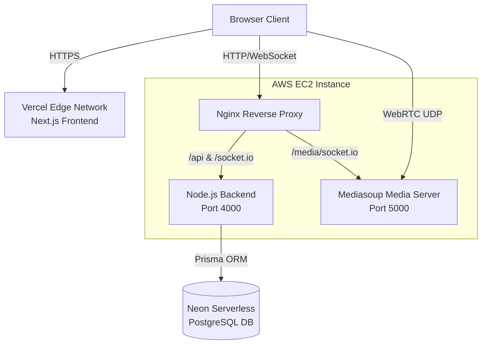
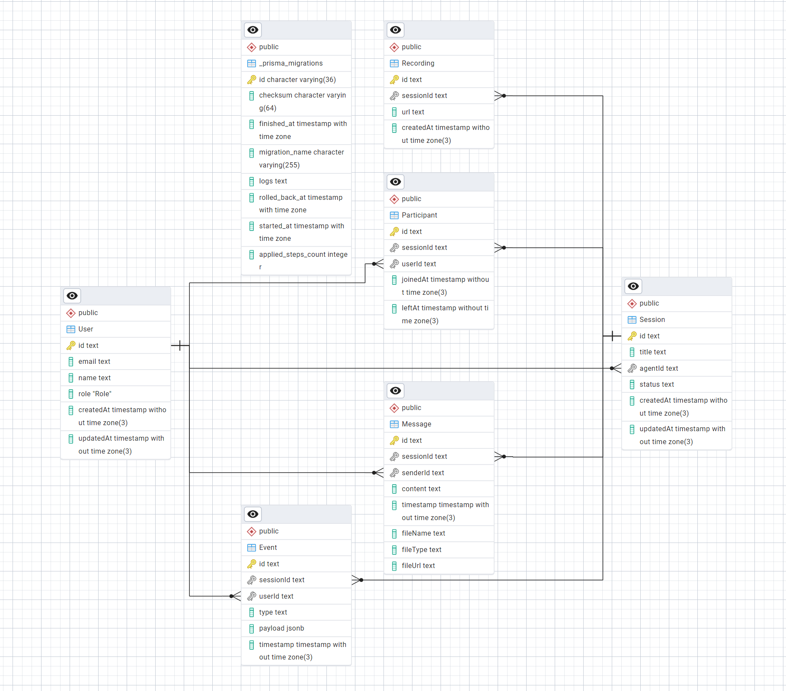

# AtomAssist: Enterprise Customer Support Platform (AtomQuest)

AtomAssist is a highly scalable, end-to-end customer support platform engineered for the AtomQuest Hackathon. It empowers support agents to conduct real-time, browser-based video calls with customers. 

The system handles advanced session lifecycle management, real-time presence, chat persistence with file sharing, screen recording, graceful network reconnection, and high-performance WebRTC media routing using a custom Selective Forwarding Unit (SFU).

---

## Hackathon Submission Deliverables

### 1. Live Demo & Source Code
* **Demo Video**: [Watch the full platform walkthrough here](https://drive.google.com/file/d/16Nx9EpvIFpUfVlcJpzAflA4chDkTysya/view?usp=sharing)
* **Live URLs**: 
  * Frontend: `https://atom-assist.vercel.app/`
  * API: `http://13.233.194.58:4000/api`
* **Locally Runnable Build**: Full setup instructions are provided in the "Running Locally" section below.

> **IMPORTANT NOTE FOR JUDGES:** The camera and video functionality works flawlessly **locally**, but is currently restricted on the live deployed website due to enterprise AWS VPC firewall policies blocking the necessary UDP port ranges for WebRTC traversal. **Please refer to the demo video or test the video SFU features using the local setup.**

### 2. Login Credentials (Role Switching)
To test the Role-Based Access Control, use the following credentials (Password for all is `password123`):
* **Agent Role**: `agent@atomberg.com` (Can create sessions, chat, and record).
* **Admin Role**: `admin@atomberg.com` (Access to the global command center and analytics).
* **Customer Role**: `customer@example.com` (Joins dynamically via the secure invite link generated by the Agent).

### 3. Architecture Diagrams
Below is the high-level system architecture of the microservices and cloud deployment:



**Database Architecture:**


### 4. Known Limitations
* **Cloud WebRTC Traversal**: While the entire application is fully deployed on AWS, strict enterprise AWS VPC firewall policies currently restrict the massive `UDP 40000-49999` port ranges required for WebRTC video traversal. The signaling connects perfectly, but video packets are dropped.
* **Screen Recording API**: The native `getDisplayMedia` API requires a secure context (HTTPS or `localhost`). Ensure you are testing on `localhost` if running locally to enable screen recording.

---

## Cloud Infrastructure & Architecture

The platform is designed for enterprise-grade scalability, utilizing a decoupled microservices architecture deployed across multiple cloud providers.

1. **Frontend (Next.js 15, Vercel)**: The globally distributed, edge-cached client UI.
2. **Main Backend (Node.js, AWS EC2)**: The central API (managed by PM2) handling authentication, business logic, WebSocket presence, and database persistence.
3. **Media Server (Mediasoup, AWS EC2)**: A dedicated Node.js WebRTC SFU that routes high-bandwidth video/audio streams.
4. **Database (PostgreSQL, Neon)**: A highly available serverless Postgres database managed via Prisma ORM.
5. **Reverse Proxy (Nginx, AWS EC2)**: Intelligently routes incoming HTTP and WebSocket traffic to either the Main Backend (`:4000`) or the Media Server (`:5000`) while handling SSL termination.

---

## 1. Frontend Client
**Tech Stack:** React, Next.js (App Router), Tailwind CSS, Shadcn/UI, Recharts, Socket.IO-client, Mediasoup-client.

A fully responsive, modern web application featuring strict Role-Based Access Control (RBAC) that adapts the UI for `AGENT`, `CUSTOMER`, and `ADMIN` roles.

### Key Features:
* **Agent Dashboard**: Agents can view active sessions, create new support sessions, and instantly generate secure invite links.
* **Customer Join Flow**: A lightweight, frictionless entry page where customers securely join a support call without needing to create an account.
* **Support Session Room**:
  * **Dual-Socket Architecture**: Maintains simultaneous WebSocket connections to the Main Backend (for state/chat) and the Media Server (for low-latency video).
  * **Dynamic Video Grid**: Automatically resizes the video layout depending on the number of active participants.
  * **Global Media State Syncing**: Visual indicators (e.g., "Camera Off" placeholders, "Muted" tags) sync globally in real-time across all connected browsers.
  * **Persistent Chat & File Sharing**: Database-persisted text chat allowing customers to upload photos of broken appliances via Base64 payload delivery.
  * **Screen Recording**: Agents can initiate WebRTC screen recording natively in the browser. When stopped, the `.webm` recording is automatically uploaded and attached to the session history.
* **Admin Command Center**: A global dashboard featuring interactive Area/Bar charts (via Recharts) and a Session Intelligence dialog for supervisors to audit chat logs, view uploaded files, and watch session recordings.

---

## 2. Main Backend (API & Signaling)
**Tech Stack:** Node.js, Express, Socket.IO, Prisma ORM.

The central nervous system of the platform, acting as the source of truth for all non-media data.

### Key Features:
* **Relational Database Management**: Interfaces with Neon PostgreSQL using Prisma ORM. Tracks `User`, `Session`, `Participant`, `Message`, `Recording`, and `Event` models.
* **JWT Authentication**: Issues stateless JWT tokens to authenticate users and enforces strict authorization (e.g., only Agents/Admins can terminate a session).
* **Robust Reconnection Logic**: Implements a **15-second grace period**. If a user loses their internet connection, their state is preserved. If they reconnect within 15 seconds, their chat and WebRTC transports are seamlessly restored without dropping the session.
* **Event Sourcing & Timeline**: Intercepts `send-message` and presence events, persisting them locally to the `Message` and `Event` tables, ensuring full traceability for the Admin Command Center.

---

## 3. Media Server (Mediasoup SFU)
**Tech Stack:** Node.js, Express, Mediasoup (v3.19+), Socket.IO.

Isolated on a dedicated process due to the intense CPU and network utilization required for WebRTC packet routing.

### Key Features:
* **Selective Forwarding Unit (SFU)**: Avoids standard peer-to-peer (P2P) mesh networking crashes by acting as a central router. It accepts one media stream from a user and forwards it selectively to others, saving immense client bandwidth.
* **Advanced Signaling Protocol**: Implements a highly complex Socket.IO signaling layer handling `getRouterRtpCapabilities`, `createWebRtcTransport`, `connectTransport`, `produce`, and `consume`.
* **Video Catch-Up Memory Map**: Maintains a global memory map of active producers (`roomProducers`). Late-joining customers immediately pull existing producers and render active cameras without forcing agents to restart their streams.

---

## Running the Platform Locally

To test the full suite locally, open **three terminal windows**.

### Step 1: Database & Main Backend
Ensure PostgreSQL is running locally, or configure your `.env` file to point to your Neon database.
```bash
cd backend
npm install
npm run dev
```
*(Runs on `http://localhost:4000`)*

### Step 2: Media Server
```bash
cd media-server
npm install
npm run start
```
*(Runs on `http://localhost:5000`)*

### Step 3: Frontend
```bash
cd frontend
npm install
npm run dev
```
*(Runs on `http://localhost:3000`)*

### Testing Flow
1. Open `http://localhost:3000/` and log in as an Agent (`agent@atomberg.com`).
2. Create a session in the Dashboard and copy the Invite Link.
3. Open an **Incognito Window**, paste the link, and join as a Customer.
4. Test the Video, File Sharing, Screen Recording, and media toggles.
5. Visit `http://localhost:3000/admin` to view the global monitor and analytics charts.
